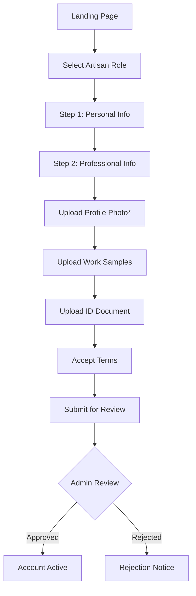
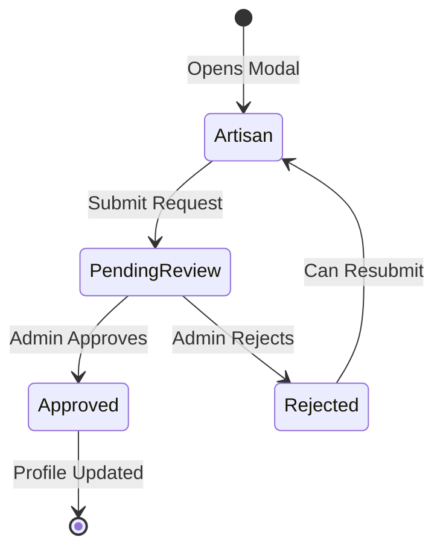
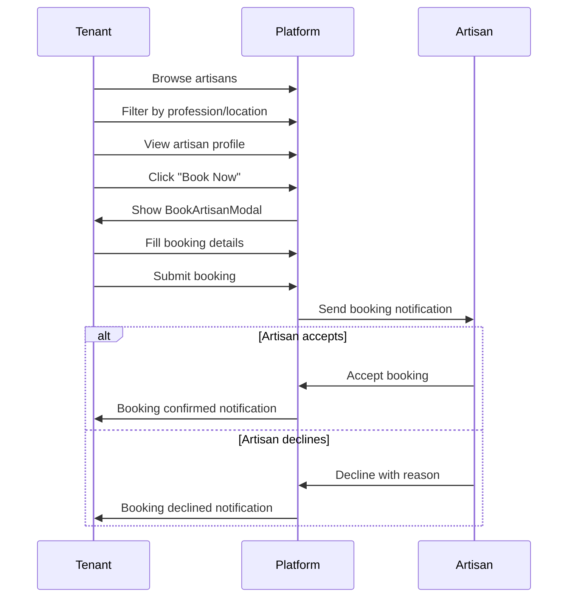

# RentalConnects Artisan System

> Last Updated: January 2026

## Table of Contents
1. [Overview](#overview)
2. [Artisan Registration](#artisan-registration)
3. [Profile Management](#profile-management)
4. [Profession Change Requests](#profession-change-requests)
5. [Tenant-Artisan Booking Flow](#tenant-artisan-booking-flow)
6. [Rating & Reviews](#rating--reviews)
7. [Admin Management](#admin-management)
8. [API Reference](#api-reference)

---

## Overview

The Artisan System enables skilled service providers (plumbers, electricians, carpenters, etc.) to connect with tenants and property owners for home maintenance and repair services.

### Key Features
- **Profile Showcase**: Artisans display skills, experience, and work samples
- **Service Booking**: Tenants can browse, filter, and book artisans
- **Trust Score**: AI-powered reputation system
- **Profession Changes**: Formal process for changing registered profession
- **Admin Oversight**: Verification and moderation workflows

---

## Artisan Registration

### Signup Flow



### Required Fields

| Field | Required | Validation |
|-------|----------|------------|
| Full Name | Yes | 2-100 characters |
| Email | Yes | Valid email format |
| Phone | Yes | Ghana phone format |
| Password | Yes | Min 8 chars, complexity rules |
| Profession | Yes | Select from list or specify |
| Profile Photo | Yes | Image, max 5MB |
| Experience | Yes | Number (years) |
| Region | Optional | Service area |
| Work Samples | Optional | Up to 5 images, max 10MB each |
| ID Document | Optional | Image/PDF, max 10MB |

### Signup Form Component

```jsx
// pages/Auth/components/ArtisanForm.jsx
export default function ArtisanForm() {
  const [form, setForm] = useState({
    fullName: "",
    email: "",
    phone: "",
    password: "",
    confirmPassword: "",
    profession: "",
    experience: "",
    region: "",
    profilePhoto: null,      // Required
    workSamples: [],         // Optional, max 5
    idUpload: null,          // Optional
    agree: false,
  });

  // Profile photo validation
  const handleProfilePhotoChange = (file) => {
    if (!file.type.startsWith("image/")) {
      setError("Please select a valid image file.");
      return;
    }
    if (file.size > 5 * 1024 * 1024) {
      setError("Profile photo must be less than 5MB.");
      return;
    }
    setForm(prev => ({ ...prev, profilePhoto: file }));
  };

  // Work samples handling
  const handleWorkSamplesChange = (files) => {
    if (form.workSamples.length + files.length > 5) {
      setError("Maximum 5 work samples allowed.");
      return;
    }
    // Validate each file...
  };
}
```

---

## Profile Management

### Profile Components

```
components/artisan/
├── ArtisanCard.jsx           # Card for listings
├── ArtisanProfile.jsx        # Full profile view
├── BookArtisanModal.jsx      # Booking modal
└── ProfessionChangeRequestModal.jsx
```

### ArtisanCard Component

```jsx
// components/artisan/ArtisanCard.jsx
export default function ArtisanCard({ artisan, onBook }) {
  const profileImage = getFirstValidImage(
    [artisan.profile_photo, artisan.profilePhoto, artisan.avatar],
    getPlaceholderImage(artisan.fullName?.[0] || "A", 200, 200)
  );

  const workSamples = artisan.workSamples || [];
  
  return (
    <div className="card">
      {/* Profile Image */}
      
      
      {/* Availability Badge */}
      {artisan.isAvailable && <span className="badge-available">Available</span>}
      
      {/* Verified Badge */}
      {artisan.isVerified && <span className="badge-verified">Verified</span>}
      
      {/* Info */}
      <h3>{artisan.fullName}</h3>
      <p>{artisan.profession}</p>
      <p>{artisan.location}</p>
      
      {/* Rating */}
      <div className="rating">
        <Star /> {artisan.rating.toFixed(1)} ({artisan.reviewCount} reviews)
      </div>
      
      {/* Work Samples Preview */}
      {workSamples.length > 0 && (
        <div className="work-samples">
          {workSamples.slice(0, 4).map((sample, i) => (
            
          ))}
          {workSamples.length > 4 && <span>+{workSamples.length - 4}</span>}
        </div>
      )}
      
      {/* Actions */}
      <Link to={`/tenant/artisans/${artisan.id}`}>View Profile</Link>
      <button onClick={() => onBook(artisan)}>Book Now</button>
    </div>
  );
}
```

### Profile Data Structure

```javascript
const artisanProfile = {
  id: "art_123",
  fullName: "Kwame Asante",
  email: "kwame@example.com",
  phone: "+233241234567",
  profession: "Electrician",
  experience: 8,
  region: "Greater Accra",
  bio: "Licensed electrician with 8 years of experience...",
  
  // Images
  profilePhoto: "https://cloudinary.../profile.jpg",
  workSamples: [
    "https://cloudinary.../work1.jpg",
    "https://cloudinary.../work2.jpg",
  ],
  
  // Verification
  isVerified: true,
  idVerified: true,
  backgroundCheckStatus: "verified",
  
  // Availability
  isAvailable: true,
  serviceAreas: ["Accra", "Tema", "East Legon"],
  workingHours: {
    monday: { start: "08:00", end: "18:00" },
    // ...
  },
  
  // Statistics
  rating: 4.8,
  reviewCount: 156,
  trustScore: 92,
  completedJobs: 203,
  responseRate: 95,
  onTimeRate: 98,
  
  // Timestamps
  createdAt: "2024-03-15T10:30:00Z",
  updatedAt: "2026-01-28T14:20:00Z",
};
```

---

## Profession Change Requests

### Request Flow



### Request Form

```jsx
// pages/Dashboards/Artisan/components/ProfessionChangeRequestModal.jsx
export default function ProfessionChangeRequestModal({ 
  open, 
  onClose, 
  currentProfession 
}) {
  const [form, setForm] = useState({
    newProfession: "",
    customProfession: "",
    reason: "",
    documents: [], // Supporting documents
  });

  const handleSubmit = async () => {
    const formData = new FormData();
    formData.append("new_profession", profession);
    formData.append("reason", form.reason);
    form.documents.forEach(doc => {
      formData.append("supporting_documents", doc);
    });
    
    await submitProfessionChangeRequest(formData);
    
    // Create notification for self
    await createNotification({
      type: "profession_change_submitted",
      title: "Request Submitted",
      message: `Your profession change request to "${profession}" is pending review.`,
    });
  };
}
```

### Admin Review Page

```jsx
// pages/Dashboards/Admin/ProfessionChangeRequestsPage.jsx
export default function ProfessionChangeRequestsPage() {
  const [requests, setRequests] = useState([]);
  const [filter, setFilter] = useState("pending");

  const handleApprove = async (request) => {
    await approveProfessionChangeRequest(request.id, approvalNotes);
    
    // Notify artisan
    await createNotification({
      type: "profession_change_approved",
      recipientId: request.artisan_id,
      title: "Profession Change Approved",
      message: `Your request to change to "${request.new_profession}" was approved.`,
    });
    
    // Send email
    await triggerEmailNotification({
      type: "profession_change_approved",
      recipientId: request.artisan_id,
      data: { new_profession: request.new_profession },
    });
  };

  const handleReject = async (request, reason) => {
    await rejectProfessionChangeRequest(request.id, reason);
    // Similar notification flow...
  };
}
```

---

## Tenant-Artisan Booking Flow

### Booking Process



### TenantArtisansPage Component

```jsx
// pages/Dashboards/Tenant/TenantArtisansPage.jsx
export default function TenantArtisansPage() {
  const [artisans, setArtisans] = useState([]);
  const [filters, setFilters] = useState({
    profession: "",
    location: "",
    minRating: "",
  });
  const [bookingArtisan, setBookingArtisan] = useState(null);

  const loadArtisans = async () => {
    const result = await getArtisans({
      search: searchTerm,
      profession: filters.profession,
      location: filters.location,
      minRating: filters.minRating,
      page,
      limit: 12,
    });
    setArtisans(result.artisans);
  };

  return (
    <div>
      {/* Search and Filters */}
      <SearchBar value={search} onChange={setSearch} />
      <Filters filters={filters} onChange={setFilters} />
      
      {/* Results */}
      <div className="grid grid-cols-3 gap-6">
        {artisans.map(artisan => (
          <ArtisanCard
            key={artisan.id}
            artisan={artisan}
            onBook={(a) => setBookingArtisan(a)}
          />
        ))}
      </div>
      
      {/* Booking Modal */}
      <BookArtisanModal
        artisan={bookingArtisan}
        open={!!bookingArtisan}
        onClose={() => setBookingArtisan(null)}
      />
    </div>
  );
}
```

### BookArtisanModal Component

```jsx
// components/artisan/BookArtisanModal.jsx
export default function BookArtisanModal({ artisan, open, onClose, onSuccess }) {
  const [form, setForm] = useState({
    serviceType: "",
    description: "",
    preferredDate: "",
    preferredTime: "",
    address: "",
  });

  const handleSubmit = async () => {
    await bookArtisan({
      artisan_id: artisan.id,
      service_type: form.serviceType,
      description: form.description,
      preferred_date: form.preferredDate,
      preferred_time: form.preferredTime,
      address: form.address,
    });

    // Create self-notification
    await createNotification({
      type: "artisan_booking_created",
      title: "Booking Submitted",
      message: `Your booking for ${artisan.fullName} has been submitted.`,
      actionUrl: "/tenant/artisan-bookings",
    });

    onSuccess?.();
  };
}
```

---

## Rating & Reviews

### Review System

```javascript
// After job completion
const submitReview = async (bookingId, reviewData) => {
  await createReview({
    booking_id: bookingId,
    artisan_id: artisanId,
    rating: reviewData.rating,          // 1-5 stars
    comment: reviewData.comment,
    service_quality: reviewData.serviceQuality,
    punctuality: reviewData.punctuality,
    professionalism: reviewData.professionalism,
    would_recommend: reviewData.wouldRecommend,
  });
};
```

### Trust Score Calculation

The Trust Score is calculated using AI analysis of:
- Overall rating (weighted)
- Review count
- Response rate
- On-time completion rate
- Verification status
- Job completion rate
- Recency of reviews

```javascript
// AI Trust Score factors
const trustScoreFactors = {
  rating: 0.25,           // 25% weight
  reviewCount: 0.15,      // 15% weight
  responseRate: 0.15,     // 15% weight
  onTimeRate: 0.15,       // 15% weight
  completionRate: 0.15,   // 15% weight
  verification: 0.10,     // 10% weight
  recency: 0.05,          // 5% weight
};
```

---

## Admin Management

### Artisan Approval Workflow

```javascript
// services/adminService.js
export const getArtisanApprovals = async (status = "pending") => {
  const { data } = await apiClient.get("/admin/artisans/approvals/", {
    params: { status },
  });
  return data;
};

export const approveArtisan = async (artisanId, notes) => {
  return apiClient.post(`/admin/artisans/${artisanId}/approve/`, { notes });
};

export const rejectArtisan = async (artisanId, reason) => {
  return apiClient.post(`/admin/artisans/${artisanId}/reject/`, { reason });
};
```

### Admin Dashboard Stats

```javascript
// Artisan-related admin stats
const artisanStats = {
  totalArtisans: 1250,
  pendingApprovals: 23,
  activeArtisans: 980,
  suspendedArtisans: 15,
  professionChangeRequests: 8,
  averageRating: 4.3,
  topProfessions: [
    { name: "Electrician", count: 320 },
    { name: "Plumber", count: 280 },
    { name: "Carpenter", count: 245 },
  ],
};
```

---

## API Reference

### Artisan Endpoints

```
# Public
GET    /api/artisans/                    List verified artisans
GET    /api/artisans/:id                 Get artisan details
GET    /api/artisans/:id/reviews         Get artisan reviews

# Authenticated (Tenant)
POST   /api/artisans/bookings/           Book an artisan
GET    /api/artisans/bookings/mine       My artisan bookings

# Authenticated (Artisan)
GET    /api/artisan/profile              Get own profile
PUT    /api/artisan/profile              Update profile
POST   /api/artisan/work-samples         Upload work samples
DELETE /api/artisan/work-samples/:id     Delete work sample
POST   /api/artisan/profession-change    Submit profession change
GET    /api/artisan/profession-change/status  Get request status

# Admin
GET    /api/admin/artisans/approvals     List pending approvals
POST   /api/admin/artisans/:id/approve   Approve artisan
POST   /api/admin/artisans/:id/reject    Reject artisan
GET    /api/admin/profession-changes     List profession requests
POST   /api/admin/profession-changes/:id/approve
POST   /api/admin/profession-changes/:id/reject
```

### Sample Requests

**Get Artisans with Filters**:
```http
GET /api/artisans/?profession=electrician&location=accra&minRating=4&page=1&limit=12
```

**Book Artisan**:
```http
POST /api/artisans/bookings/
Content-Type: application/json

{
  "artisan_id": "art_123",
  "service_type": "Wiring",
  "description": "Need electrical wiring for new room",
  "preferred_date": "2026-02-15",
  "preferred_time": "morning",
  "address": "123 Main St, East Legon, Accra"
}
```

**Submit Profession Change**:
```http
POST /api/artisan/profession-change
Content-Type: multipart/form-data

new_profession: Electrician
reason: Completed certification training
supporting_documents: [file1.pdf, file2.jpg]
```

---

*See also:*
- [Platform Architecture](./PLATFORM_ARCHITECTURE.md)
- [Notification System](./NOTIFICATION_SYSTEM.md)
- [AI Integration](./AI_INTEGRATION.md)
