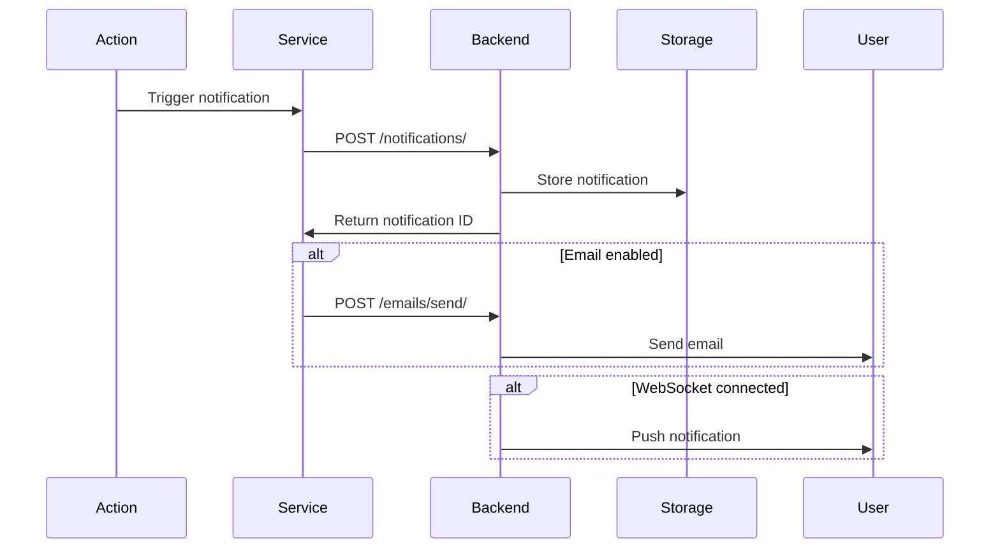

# RentalConnects Notification System

> Last Updated: January 2026

## Table of Contents
1. [Overview](#overview)
2. [Notification Types](#notification-types)
3. [In-System Notifications](#in-system-notifications)
4. [Email Notifications](#email-notifications)
5. [Notification Lifecycle](#notification-lifecycle)
6. [Implementation Guide](#implementation-guide)
7. [API Reference](#api-reference)

---

## Overview

RentalConnects implements a comprehensive notification system that keeps users informed about important events through multiple channels:

- **In-System Notifications**: Implemented. Backed by `notificationService.js`, `notificationHelpers.js`, and UI components under `components/notifications`.
- **Email Notifications**: Implemented on the frontend via `emailService.js` and `emailTemplates.js`. Delivery depends on backend email endpoints documented in `API_REFERENCE.md`.
- **Push Notifications**: **Not yet implemented**. Described here for future backend and frontend expansion.

---

## Notification Types

### Category: Account & Security
| Type | Description | Channels |
|------|-------------|----------|
| `role_promoted` | User promoted to new role | In-System, Email |
| `account_suspended` | Account temporarily suspended | In-System, Email |
| `account_banned` | Account permanently banned | Email |
| `account_restored` | Account restored after suspension | In-System, Email |
| `login_new_device` | Login from new device detected | Email |
| `password_changed` | Password successfully changed | Email |
| `2fa_enabled` | Two-factor authentication enabled | Email |

### Category: Property & Bookings
| Type | Description | Channels |
|------|-------------|----------|
| `property_approved` | Property listing approved | In-System, Email |
| `property_rejected` | Property listing rejected | In-System, Email |
| `booking_request` | New booking request received | In-System, Email |
| `booking_confirmed` | Booking confirmed | In-System, Email |
| `booking_cancelled` | Booking cancelled | In-System, Email |
| `lease_expiring` | Lease expiring soon | In-System, Email |

### Category: Artisan Services
| Type | Description | Channels |
|------|-------------|----------|
| `artisan_booking_created` | New artisan booking | In-System |
| `artisan_booking_accepted` | Artisan accepted job | In-System, Email |
| `artisan_booking_completed` | Job completed | In-System |
| `profession_change_submitted` | Profession change request submitted | In-System |
| `profession_change_approved` | Profession change approved | In-System, Email |
| `profession_change_rejected` | Profession change rejected | In-System, Email |

### Category: Platform
| Type | Description | Channels |
|------|-------------|----------|
| `announcement` | Platform-wide announcement | In-System, Email (optional) |
| `maintenance` | Scheduled maintenance notice | In-System |
| `feature_update` | New feature announcement | In-System |

---

## In-System Notifications

### Component Architecture

```
src/
├── components/
│   └── notifications/
│       ├── NotificationBell.jsx      # Header notification icon
│       ├── NotificationPanel.jsx     # Dropdown panel
│       ├── NotificationItem.jsx      # Single notification
│       └── NotificationPreferences.jsx
├── services/
│   └── notificationService.js        # API functions
├── stores/
│   └── notificationStore.js          # Zustand store
└── utils/
    └── notificationHelpers.js        # Type configs, icons
```

### Notification Helper Functions

```javascript
// utils/notificationHelpers.js

// Get notification category
export const getNotificationCategory = (type) => {
  if (type.startsWith('role_')) return 'role';
  if (type.includes('account_')) return 'account_status';
  if (type.includes('property_')) return 'property';
  if (type.includes('booking_')) return 'booking';
  if (type.includes('artisan_')) return 'artisan';
  return 'general';
};

// Get notification icon
export const getNotificationIcon = (type) => {
  const icons = {
    role_promoted: Crown,
    account_suspended: Ban,
    account_banned: Ban,
    property_approved: CheckCircle,
    booking_request: Calendar,
    // ... more mappings
  };
  return icons[type] || Bell;
};

// Get notification colors
export const getNotificationColors = (category) => {
  const colors = {
    role: 'purple',
    account_status: 'red',
    property: 'blue',
    booking: 'green',
    artisan: 'amber',
    general: 'gray',
  };
  return colors[category] || 'gray';
};
```

### Creating In-System Notifications

```javascript
// services/notificationService.js
import apiClient from './apiClient';

export const createNotification = async ({
  type,
  title,
  message,
  actionUrl,
  recipientId,
  metadata = {},
}) => {
  const { data } = await apiClient.post('/notifications/', {
    type,
    title,
    message,
    action_url: actionUrl,
    recipient_id: recipientId,
    metadata,
  });
  return data;
};

// Usage example
await createNotification({
  type: 'role_promoted',
  title: 'Congratulations! You\'ve Been Promoted',
  message: 'You have been promoted to Admin.',
  actionUrl: '/admin/overview',
  metadata: {
    new_role: 'admin',
    promoted_by: currentUser.id,
  },
});
```

---

## Email Notifications

### Email Templates

Email templates are defined in `src/utils/emailTemplates.js`:

```javascript
// Template structure
export const generateRolePromotionEmail = ({ userName, newRole, promotedBy }) => {
  return {
    subject: `🎉 Congratulations! You've been promoted to ${newRole}`,
    html: `
      <!DOCTYPE html>
      <html>
        <head>
          <style>
            /* Email CSS styles */
          </style>
        </head>
        <body>
          <div class="container">
            <div class="header">
              <h1>Role Promotion</h1>
            </div>
            <div class="content">
              <p>Dear ${userName},</p>
              <p>We're excited to inform you that you've been promoted to <strong>${newRole}</strong>!</p>
              <p>This promotion was granted by ${promotedBy}.</p>
              <a href="${dashboardUrl}" class="button">Go to Dashboard</a>
            </div>
          </div>
        </body>
      </html>
    `,
  };
};
```

### Available Email Templates

| Template | Function | Use Case |
|----------|----------|----------|
| `generateRolePromotionEmail` | Role promotion notifications | When admin promotes user |
| `generateAccountSuspensionEmail` | Suspension notice | When account suspended |
| `generateAccountBannedEmail` | Ban notice | When account banned |
| `generateAccountRestoredEmail` | Restoration notice | When account restored |
| `generateAnnouncementEmail` | Platform announcements | Broadcast messages |
| `generatePropertyApprovalEmail` | Property approved | Property listing approved |
| `generateBookingConfirmationEmail` | Booking confirmed | Booking confirmed |

### Email Service

```javascript
// services/emailService.js
import apiClient from './apiClient';
import { generateEmailHTML } from '@/utils/emailTemplates';

export const sendEmail = async ({ to, template, data }) => {
  const emailContent = generateEmailHTML[template](data);
  
  return apiClient.post('/emails/send/', {
    recipient: to,
    subject: emailContent.subject,
    html: emailContent.html,
  });
};

// Specialized functions
export const sendRolePromotionEmail = async (user, promotionData) => {
  return sendEmail({
    to: user.email,
    template: 'rolePromotion',
    data: {
      userName: user.fullName || user.name,
      newRole: promotionData.newRole,
      promotedBy: promotionData.promotedBy,
    },
  });
};

// Batch sending for announcements
export const sendAnnouncementEmailBatch = async (users, announcement) => {
  const BATCH_SIZE = 50;
  const batches = [];
  
  for (let i = 0; i < users.length; i += BATCH_SIZE) {
    batches.push(users.slice(i, i + BATCH_SIZE));
  }
  
  for (const batch of batches) {
    await Promise.all(
      batch.map(user => 
        sendEmail({
          to: user.email,
          template: 'announcement',
          data: {
            userName: user.fullName,
            announcement,
          },
        })
      )
    );
  }
};
```

---

## Notification Lifecycle

### Creation Flow



### Notification States

| State | Description |
|-------|-------------|
| `unread` | New notification, not yet viewed |
| `read` | User has viewed the notification |
| `archived` | User has archived/dismissed |
| `deleted` | Soft deleted (retained for audit) |

### Lifecycle Events

```javascript
// Mark as read
await markNotificationRead(notificationId);

// Mark all as read
await markAllNotificationsRead();

// Delete notification
await deleteNotification(notificationId);

// Archive notification
await archiveNotification(notificationId);
```

---

## Implementation Guide

### Adding a New Notification Type

1. **Define the type in notificationHelpers.js**:
```javascript
// Add to getNotificationCategory
if (type.startsWith('payment_')) return 'payment';

// Add icon mapping
payment_received: DollarSign,

// Add color scheme
payment: 'green',
```

2. **Create email template (if needed)**:
```javascript
// utils/emailTemplates.js
export const generatePaymentReceivedEmail = ({ userName, amount, date }) => ({
  subject: `Payment Received - ${amount}`,
  html: `...template HTML...`,
});
```

3. **Add send function to emailService**:
```javascript
export const sendPaymentReceivedEmail = async (user, paymentData) => {
  return sendEmail({
    to: user.email,
    template: 'paymentReceived',
    data: paymentData,
  });
};
```

4. **Trigger from relevant action**:
```javascript
// After successful payment
await createNotification({
  type: 'payment_received',
  title: 'Payment Received',
  message: `You received ${amount} from ${payer}`,
  recipientId: landlordId,
});

sendPaymentReceivedEmail(landlord, { amount, date }).catch(console.warn);
```

### Best Practices

1. **Non-blocking emails**: Always use `.catch()` for email sends
2. **User preferences**: Check user's notification preferences
3. **Rate limiting**: Avoid notification spam
4. **Actionable content**: Include relevant action URLs
5. **Localization**: Use i18n for notification content

---

## API Reference

### Endpoints

```
POST   /api/notifications/           Create notification
GET    /api/notifications/           List user's notifications
GET    /api/notifications/:id        Get single notification
PATCH  /api/notifications/:id        Update notification (mark read)
DELETE /api/notifications/:id        Delete notification
POST   /api/notifications/mark-all-read  Mark all as read
GET    /api/notifications/unread-count   Get unread count

POST   /api/emails/send/             Send email
POST   /api/emails/batch/            Batch send emails
GET    /api/emails/templates/        List available templates
```

### Request/Response Examples

**Create Notification**:
```http
POST /api/notifications/
Content-Type: application/json

{
  "type": "booking_confirmed",
  "title": "Booking Confirmed",
  "message": "Your booking for 3 Bed Apartment has been confirmed.",
  "action_url": "/tenant/bookings/123",
  "recipient_id": "user_456",
  "metadata": {
    "property_id": "prop_789",
    "booking_id": "book_123"
  }
}
```

**Response**:
```json
{
  "id": "notif_001",
  "type": "booking_confirmed",
  "title": "Booking Confirmed",
  "message": "Your booking for 3 Bed Apartment has been confirmed.",
  "action_url": "/tenant/bookings/123",
  "is_read": false,
  "created_at": "2026-01-28T10:30:00Z"
}
```

---

*See also:*
- [Platform Architecture](./PLATFORM_ARCHITECTURE.md)
- [Email Templates Source](../src/utils/emailTemplates.js)
- [Notification Service](../src/services/notificationService.js)
