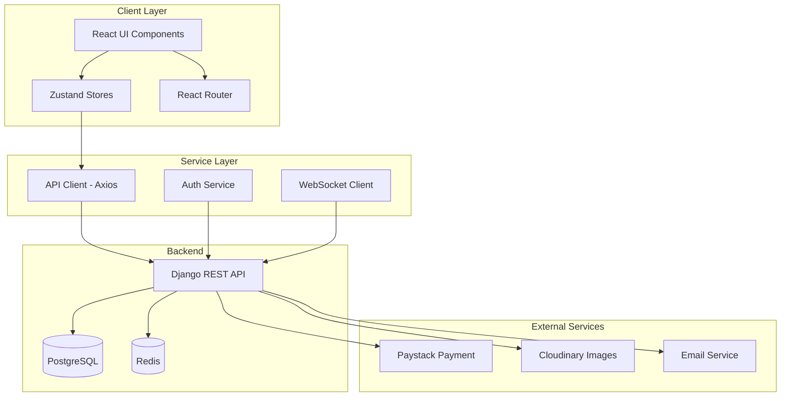
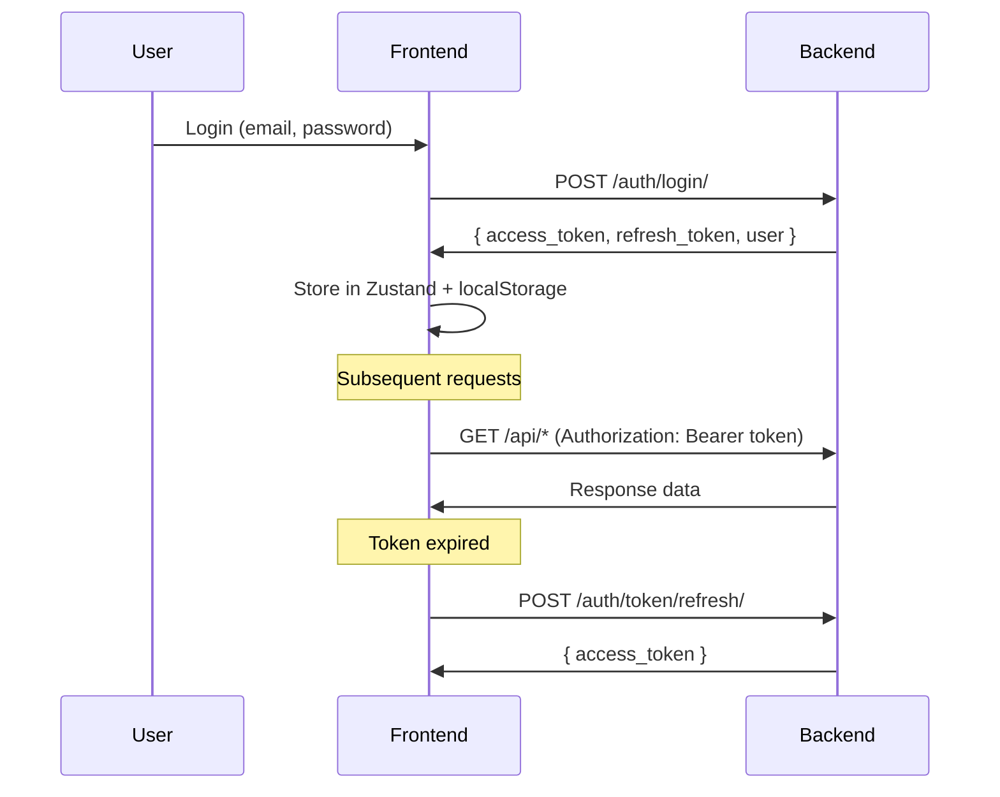
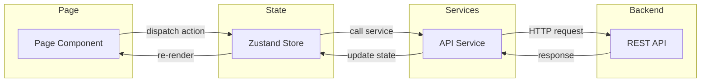
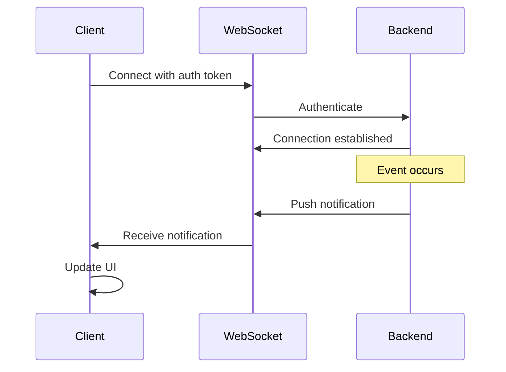

# RentalConnects Platform Architecture

> Last Updated: January 2026

## Table of Contents
1. [Overview](#overview)
2. [Technology Stack](#technology-stack)
3. [Architecture Diagram](#architecture-diagram)
4. [Component Structure](#component-structure)
5. [State Management](#state-management)
6. [Routing](#routing)
7. [API Integration](#api-integration)
8. [Authentication & Authorization](#authentication--authorization)
9. [Data Flow](#data-flow)

---

## Overview

RentalConnects is a modern rental property management platform serving multiple user roles across Ghana. The platform facilitates connections between tenants, landlords, and artisans while providing administrative oversight through a role-based access control system.

### Implementation Status
- **Frontend**: Implemented as a single-page React application using the structure and patterns described in this document.
- **Backend**: Django REST API expected to expose the endpoints specified in `API_REFERENCE.md`. Some endpoints are still **pending backend implementation** and are currently backed by mock data in development where noted.

### Core User Roles
- **Tenant**: Browse properties, make bookings, hire artisans, manage leases
- **Landlord**: List properties, manage tenants, receive payments
- **Artisan**: Offer services, manage bookings, build reputation
- **Admin**: Moderate content, approve users/properties, manage platform
- **Super Admin**: Full system access, role delegation, system configuration

---

## Technology Stack

### Frontend
| Category | Technology | Version |
|----------|-----------|---------|
| Framework | React | 19.x |
| Build Tool | Vite | 6.x |
| Styling | Tailwind CSS | 4.x |
| State Management | Zustand | 5.x |
| Routing | React Router | 7.x |
| Animation | Framer Motion | 11.x |
| Icons | Lucide React | latest |
| Forms | React Hook Form | 7.x |
| Validation | Zod | 3.x |
| i18n | i18next | 24.x |

### Backend Integration
| Category | Technology |
|----------|-----------|
| HTTP Client | Axios |
| Real-time | Socket.io-client, react-use-websocket |
| Payment | Paystack |
| Maps | Leaflet, OpenLayers |
| Image Upload | Cloudinary |

### Development Tools
| Tool | Purpose |
|------|---------|
| ESLint | Code linting |
| Prettier | Code formatting |
| Husky | Git hooks |
| Vitest | Unit testing |

---

## Architecture Diagram



---

## Component Structure

```
src/
├── assets/              # Static assets (images, fonts)
├── components/          # Reusable UI components
│   ├── ads/            # Advertisement components
│   ├── ai/             # AI-related components (Chatbot, Trust Score)
│   ├── artisan/        # Artisan-specific components
│   ├── auth/           # Authentication forms
│   ├── common/         # Shared utility components
│   ├── layout/         # Layout components (Header, Sidebar, Footer)
│   ├── legal/          # Legal/Terms components
│   ├── property/       # Property-related components
│   ├── reviews/        # Review system components
│   ├── security/       # Security components (2FA)
│   ├── shared/         # Cross-feature shared components
│   └── ui/             # Base UI components (Button, Input, Modal)
├── config/              # Configuration files
├── context/             # React Context providers
├── hooks/               # Custom React hooks
├── mocks/               # Mock data and adapters
├── modules/             # Feature modules
│   └── dashboard/       # Dashboard-specific modules
├── pages/               # Page components
│   ├── Auth/           # Authentication pages
│   ├── Dashboards/     # Role-specific dashboards
│   │   ├── Admin/
│   │   ├── Artisan/
│   │   ├── Landlord/
│   │   ├── SuperAdmin/
│   │   └── Tenant/
│   ├── Landing/        # Public landing pages
│   ├── LearnMore/      # Informational pages
│   └── Profile/        # User profile pages
├── routes/              # Route configurations
├── services/            # API service functions
├── stores/              # Zustand state stores
└── utils/               # Utility functions
```

---

## State Management

### Zustand Stores

| Store | Purpose | Key State |
|-------|---------|-----------|
| `authStore` | Authentication state | user, token, isAuthenticated |
| `featureStore` | Feature flags & subscriptions | plan, features |
| `notificationStore` | Notification management | notifications, unreadCount |

### Store Pattern
```javascript
// Example: authStore.js
import { create } from 'zustand';
import { persist } from 'zustand/middleware';

export const useAuthStore = create(
  persist(
    (set, get) => ({
      user: null,
      token: null,
      isAuthenticated: false,
      
      login: async (credentials) => {
        // Login logic
      },
      
      logout: () => {
        set({ user: null, token: null, isAuthenticated: false });
      },
      
      // Role helpers
      isLandlord: () => get().user?.role === 'landlord',
      isArtisan: () => get().user?.role === 'artisan',
      isAdmin: () => ['admin', 'super-admin'].includes(get().user?.role),
    }),
    { name: 'auth-storage' }
  )
);
```

---

## Routing

### Route Structure
```javascript
// Public routes (unauthenticated)
/                    // Landing page
/login               // Login page
/signup/:role        // Role-specific signup
/properties          // Public property listings
/learn-more          // Platform information

// Protected routes (authenticated)
/:role/overview      // Dashboard overview
/:role/properties    // Property management
/:role/messages      // Messaging
/:role/profile       // User profile

// Admin routes
/admin/users         // User management
/admin/approvals     // Approval queue
/admin/audit         // Audit logs

// Super Admin routes
/super-admin/*       // All admin routes plus...
/super-admin/role-delegation
/super-admin/announcements
```

### Route Guards
- `ProtectedRoute`: Requires authentication
- `RoleGuard`: Validates user role access
- `ApprovalGuard`: Checks user approval status

---

## API Integration

### API Client Configuration
```javascript
// services/apiClient.js
const apiClient = axios.create({
  baseURL: import.meta.env.VITE_API_BASE_URL,
  headers: { 'Content-Type': 'application/json' },
});

// Request interceptor - adds JWT token
apiClient.interceptors.request.use((config) => {
  const token = useAuthStore.getState().token;
  if (token) {
    config.headers.Authorization = `Bearer ${token}`;
  }
  return config;
});

// Response interceptor - handles token refresh
apiClient.interceptors.response.use(
  (response) => response,
  async (error) => {
    if (error.response?.status === 401) {
      // Handle token refresh or logout
    }
    return Promise.reject(error);
  }
);
```

### Service Functions Pattern
```javascript
// services/propertyService.js
export const fetchProperties = async (filters = {}) => {
  const { data } = await apiClient.get('/properties/', { params: filters });
  return data;
};

export const createProperty = async (propertyData) => {
  const { data } = await apiClient.post('/properties/', propertyData);
  return data;
};
```

---

## Authentication & Authorization

### JWT Flow


### Role-Based Access Control (RBAC)
```javascript
// Access control matrix
const ACCESS_MATRIX = {
  tenant: ['properties.view', 'bookings.create', 'artisans.book'],
  landlord: ['properties.manage', 'tenants.view', 'payments.receive'],
  artisan: ['services.manage', 'bookings.accept', 'profile.showcase'],
  admin: ['users.moderate', 'content.approve', 'reports.view'],
  'super-admin': ['*'], // Full access
};
```

---

## Data Flow

### Component Data Flow


### Real-time Updates (WebSocket)


---

## Environment Configuration

### Required Environment Variables
```env
# API Configuration
VITE_API_BASE_URL=https://api.rentalconnects.com
VITE_WS_URL=wss://api.rentalconnects.com/ws

# Authentication
VITE_JWT_SECRET_KEY=your-secret-key

# External Services
VITE_PAYSTACK_PUBLIC_KEY=pk_live_xxx
VITE_CLOUDINARY_CLOUD_NAME=your-cloud
VITE_CLOUDINARY_UPLOAD_PRESET=preset-name

# Feature Flags
VITE_ENABLE_MOCK_MODE=false
VITE_ENABLE_AI_FEATURES=true
```

---

## Performance Considerations

### Code Splitting
- Route-based lazy loading via `React.lazy()`
- Dynamic imports for heavy components
- Vendor chunk separation in build config

### Caching Strategy
- Service worker for offline support
- React Query / SWR for API response caching
- LocalStorage for persistent state (Zustand persist)

### Image Optimization
- Cloudinary transformations
- Lazy loading with intersection observer
- Placeholder images for loading states

---

## Security Measures

1. **XSS Prevention**: React's automatic escaping + DOMPurify for user content
2. **CSRF Protection**: Django CSRF tokens + SameSite cookies
3. **Input Validation**: Zod schemas for all form inputs
4. **API Security**: JWT with short expiry + refresh tokens
5. **2FA Support**: TOTP-based two-factor authentication

---

## Deployment

### Build Process
```bash
npm run build        # Production build
npm run preview      # Preview production build locally
```

### Hosting
- **Frontend**: Vercel (recommended) or Netlify
- **Backend**: Django on AWS/GCP/Heroku
- **Database**: PostgreSQL (managed)
- **CDN**: Cloudinary for images, Vercel Edge for static assets

---

*For more specific documentation, see:*
- [Notification System](./NOTIFICATION_SYSTEM.md)
- [Artisan System](./ARTISAN_SYSTEM.md)
- [AI Integration](./AI_INTEGRATION.md)
